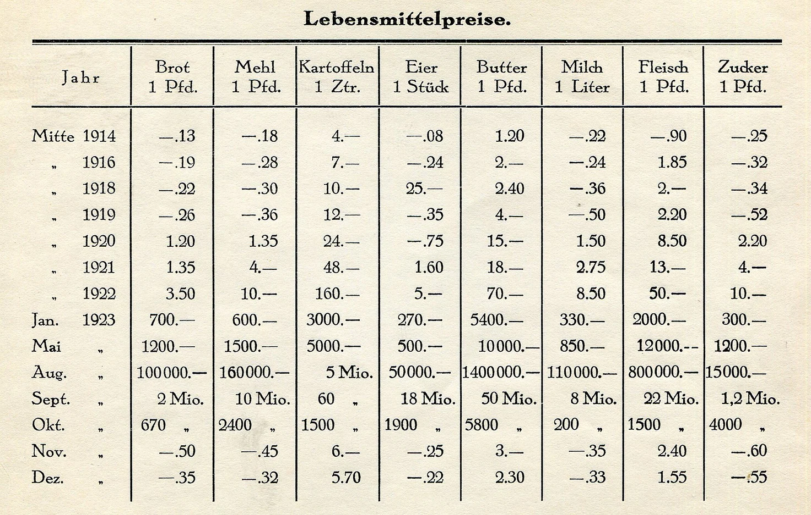

class: title-slide

```{r xaringan-themer, include=FALSE}
library(xaringanthemer)
style_xaringan(text_color = "#232461",inverse_text_color = "#FFFFFF",inverse_background_color = "#232461", title_slide_background_color = "#232461",header_background_color = "#232461",header_color = "#FFFFFF",header_h1_font_size = "32px",
  header_h2_font_size = "26px",link_color="#d84116",
  header_h3_font_size = "20px",text_slide_number_color = "#232461",text_slide_number_font_size = "0.5em")
```

```{r xaringanExtra, echo=FALSE}
xaringanExtra::use_xaringan_extra(c("tile_view","scribble","panelset","tachyons"))
xaringanExtra::style_panelset_tabs(font_family = "inherit")
#xaringanExtra::use_search(show_icon = TRUE)
#weitere: "share_again","animate_css", "webcam","freezeframe","clipboard","fit_screen","extra-styles" 
xaringanExtra::use_editable(expires = 1)
``` 

```{r setup, include=FALSE}
options(htmltools.dir.version = FALSE)
library(fontawesome)
```


# Schnuppervorlesung


## WiSA - Wessenberg informiert über Studium und Ausbildung  

### Prof. Dr. Jörg Schoder


# Inflation - Herausforderung für Bürger, Unternehmen und Politik


---
layout: true

<div class="my-footer"></div>       

<div style="position: absolute;left:400px;bottom:10px;color:ISBAblue;font-size:9px">`r r2symbols::sym('copyright')``r rmarkdown::metadata$author`</div>


---
name: Preis-dashboard
class: left

# Preise und Inflation

.panelset[
.panel[.panel-name[Dashboard D]
```{r, echo=FALSE,fig.align='center'}
knitr::include_url('https://www.dashboard-deutschland.de/',height='480px')
```
.quellePanURL[Quelle:[Statistisches Bundesamt](https://www.dashboard-deutschland.de).]
]
.panel[.panel-name[Inflationsmessung]
* Ein Preisindex misst das Preisniveau (Durchschnittliche Güterpreise)
* Die Inflation(srate) gibt Auskunft über die Preissteigerungen
$$\pi_t=\frac{P_t-P_{t-1}}{P_{t-1}}=\frac{P_t}{P_{t-1}}-1$$

* Beispiel Verbraucherpreisindex (VPI): 
    * Oktober 2022: 122,2
    * Oktober 2021: 110,7

$$\pi_{Okt22}=\frac{122,2-110,7}{110,7}\approx 0,10388 \Rightarrow 10,39\%$$ 
]
.panel[.panel-name[Indikatoren]
* Aggregierte Betrachtung: [BIP-Deflator bzw. Preisindex des BIP](https://www.destatis.de/DE/Themen/Wirtschaft/Volkswirtschaftliche-Gesamtrechnungen-Inlandsprodukt/Publikationen/Downloads-Inlandsprodukt/inlandsprodukt-lange-reihen-pdf-2180150.pdf?__blob=publicationFile)
(Konsum- und Investitionsgüter/Vorprodukte)
   

* [Disaggregierte Betrachtung](https://www.dashboard-deutschland.de/indicator/data_preisentwicklung?mtm_campaign=dd-social-sharing)

    * Produktion: Erzeugerpreise
    
    * Außenhandel: Importpreise
    
    * Großhandel: Großhandelspreise (Einkaufspreise)
    
    * Konsum: Verbraucherpreise (VPI/HVPI)
]
.panel[.panel-name[Indikatorenvergleich]
```{r, echo=FALSE,fig.align='center',out.width='100%'}
knitr::include_url('https://www.wirtschaftsdienst.eu/files/journal-issues/wirtschaftsdienst/10.1007/s10273-020-2778-0/ZG-Weichen-abb-1.png',height='480px')
```

.quellePanURL[Quelle: [Weichenrieder/Gürer (2020)](https://www.wirtschaftsdienst.eu/inhalt/jahr/2020/heft/11/beitrag/inflation-inflationsmessung-und-zentralbankpolitik.html).]
]
]

???

`r fa("circle-right")` 10,39%

---
name: Deflation
class: left


# Deflation

```{r, echo=FALSE,fig.align='center',out.height='100%'}
knitr::include_url('../images/comic_deflation_(Bauman_S55).png',height='550px')
```

.quelle[Quelle: [Bauman (2011, S. 48)](https://www.amazon.de/dp/0809033615/ref=cm_sw_em_r_mt_dp_5WNEX8X23YD4AVNFM9Y9).]

???

* Inflation im Boom vs. Stagflation


---
name: Inflation
class: left

# Inflation und Geldwert


.blockquote[
Inflation

Eine über einen längeren Zeitraum anhaltende Zunahme des Preisniveaus bzw. sinkende Kaufkraft. 
]

* Preisniveau
      * Preis als objektiver Tauschwert eines Gutes in Marktwirtschaften.
      * Preisniveau als durschnittlicher Preis aller (produzierten) Güter.

* Inflation vs. Disinflation vs. [Deflation vs. Stagflation](#Deflation)


.blockquote[
Die **Kaufkraft**...

...gibt an, welche Gütermenge mit einer gegebenen Geldsumme erworben
werden kann (**Geldwert**).
]

* Obs! **Den** Geldwert gibt es nicht (`r fa("circle-right")` [individueller Verwendungszweck](#PersInf)).


???

* Disinflation: Abnehmende/rückläufige Inflationsraten. 
* Deflation: Gegenteil von Inflation, also fallende Preise (negative Inflationsraten)


---
name: kaufkraftverlust-interaktiv
class: left

# Kaufkraftverlust bei unterschiedlichen Inflationsraten

```{r,echo=FALSE,message=FALSE}
library(tidyverse)
library(scales)
library(plotly)
rate <- c(.02,.04,.06,.08,.1)
periode <- c(0:50)
grid <- expand.grid(rate,periode) %>% 
                          rename(Rate=Var1,Periode=Var2)
df_plot <- grid %>% 
              mutate(Kaufkraft=(1-Rate)^Periode,
                Inflationsrate=factor(Rate,labels = c('2%','4%','6%','8%','10%'))
                )


#p <- df_plot %>% 
#        ggplot(aes(x=Periode,y=Kaufkraft,color=Inflationsrate)) +
#           geom_line(stat='identity',size=1.1) +
#           scale_y_continuous(labels= scales::percent_format(accuracy #= 1)) +
#           ylab("Kaufkraft (in % von Periode 1)") +
#           guides(color=guide_legend("Inflationsrate (p.a.)")) +
#           theme_light() +
#           theme(legend.position = 'bottom')
#p           
p <- df_plot %>% 
        plot_ly(x = ~Periode, y = ~Kaufkraft, color = ~Inflationsrate,
            width=700, height=480) %>% 
          add_lines()  %>% 
          layout(xaxis=list(title="Periode"),  
                 yaxis=list(tickformat = ".1%",
                            title="Kaufkraft (in % Periode 1)")
          ) 
htmltools::save_html(p, file="kaufkraft.html") 


```

<iframe src="kaufkraft.html" width="1000" height="550" scrolling="yes" seamless="seamless" frameBorder="0"> </iframe>

.quelle[Eigene Darstellung.]


---
name: PersInfl
class: left

# Persönliche Inflationsrate

.panelset[
.panel[.panel-name[Mitmachen 1]
```{r, echo=FALSE,fig.align='center'}
knitr::include_url('../images/Destatis_PersInf.svg',height='450px')
```  
]
.panel[.panel-name[Inflationsrechner]
```{r, echo=FALSE,fig.align='center',out.width='100%'}
knitr::include_url('https://service.destatis.de/inflationsrechner/',height='480px')
```
]
.panel[.panel-name[Mitmachen 2]
```{r, echo=FALSE,fig.align='center'}
knitr::include_url('../images/MSForms_PersInf.svg',height='450px')
```
]
]

???

* Durchschnittlicher Warenkorb vs. individuelle Gewichtung


---
name: Preiskaleidoskop
class: left

# Verbraucherpreisindex

```{r, echo=FALSE,fig.align='center',out.width='100%'}
knitr::include_url('https://service.destatis.de/Voronoi/PreisKaleidoskop.svg',height='550px')
```


???
* Deflator (Verwendungsseite, Seite 122): 112,06 (2021; 2015=100)
* VPI (Dashboard): 111,1 (Dez 2021; 2015=100)

* [Quelle: [Statistisches Bundesamt](https://www.destatis.de/DE/Themen/Wirtschaft/Preise/_inhalt.html).]
    
    
* [Methodik](https://www.destatis.de/DE/Methoden/Qualitaet/Qualitaetsberichte/Preise/verbraucherpreis.pdf?__blob=publicationFile)

* [Güterkategorien im Detail](https://www.destatis.de/DE/Themen/Wirtschaft/Preise/Verbraucherpreisindex/Methoden/Downloads/waegungsschema-2015.pdf?__blob=publicationFile)


* BIP-Deflator vs. VPI
  * [BIP-Deflator](https://www.destatis.de/DE/Themen/Wirtschaft/Volkswirtschaftliche-Gesamtrechnungen-Inlandsprodukt/Publikationen/Downloads-Inlandsprodukt/inlandsprodukt-vorlaeufig-pdf-2180140.pdf?__blob=publicationFile) - Preise der im Inland **produzierten** Güter
      * 
  * [VPI Dashboard](https://www.dashboard-deutschland.de/indicator/data_preisentwicklung?mtm_campaign=dd-social-sharing) - Preise der im Inlande **konsumierten** Güter
  
* Berechnung des BIP-Deflators: Division des zu einer Messzahl umgerechneten Ergebnis in jeweiligen Preisen (nominales BIP) dividiert durch die entsprechende preisbereinigte Größe (reales BIP).
			* BIP-Deflator: nominales BIP-Wachstum abzüglich reales BIP-Wachstum (Näherungsformel!).
			* BIP-Kettenindex: (= 100 im Jahr 2010)
			      Vorjahreswert $\cdot$ (1 + reales BIP-Wachstum).
			* BIP-Deflator: (= 100 im Jahr 2010) 
	  		    Vorjahreswert $\cdot$ (1 + Inflationsrate (BIP-Deflator)).


---
name: Preise
class: left

# Hyperinflation

.panelset[
.panel[.panel-name[Zeitreihe]
```{r, echo=FALSE,fig.align='center',out.width='100%',out.height = '480px'}

```
.quellePan[Quelle: [Bundeszentrale für Politische Bildung (2015)](https://www.bpb.de/system/files/dokument_pdf/4938_zb_dtindaten_gesamt.pdf)]
]
.panel[.panel-name[Geldwert]
```{r, echo=FALSE,fig.align='center',out.width='100%',out.height='480px'}

```
.quellePan[Quelle: [MDR (2022)](https://www.mdr.de/geschichte/zeitgeschichte-gegenwart/wirtschaft/inflation-prognose-bundesbank-deutschland-hyperinflation-zwanziger-jahre-armut-100.html)]
]
.panel[.panel-name[Lebensmittel]
```{r, echo=FALSE,fig.align='center',out.width='100%',out.height='480px'}

```
.quellePan[Quelle: [MDR (2022)](https://www.mdr.de/geschichte/zeitgeschichte-gegenwart/wirtschaft/inflation-prognose-bundesbank-deutschland-hyperinflation-zwanziger-jahre-armut-100.html)]
]
]


???

* Deutschland zur Zeit der Weimarer Republik
    * Hyperinflation 20er Jahre,
    * Deflation 30er Jahre
* bezogen auf „alle“ Güter stiegen die Preise um 29.500%
monatlich
* Illustration anhand einzelner Güter:
    * Preis einer Tageszeitung (D1921-1923)
        * 01/1921 0,3 Mark,
        * 11/1923 70 Mio Mark
* Die Umstellung von der *Mark* (M) auf die *Rentenmark* (RM) im November 1923 mit einem Kurs von 1 Billion Mark zu 1 Rentenmark beendete die Deutsche Inflation 1914 bis 1923


---
name: Preise
class: left

# Internationaler Vergleich

.panelset[
.panel[.panel-name[International]
<iframe src="https://ourworldindata.org/grapher/inflation-levels-and-volatility-in-high--and-low-income-economies-1960-2017" loading="lazy" style="width: 100%; height: 480px; border: 0px none;"></iframe>
]
]


---
name: Prod
class: left


# Produktivität und Inflation

.panelset[
.panel[.panel-name[Benzin]
```{r, echo=FALSE,fig.align='center',out.width='100%'}
knitr::include_graphics('https://www.iwkoeln.de/fileadmin/user_upload/Presse/IW-Nachrichten/Inflation_1.png')
```
]
.panel[.panel-name[Strom]
```{r, echo=FALSE,fig.align='center',out.width='100%'}
knitr::include_graphics('https://www.iwkoeln.de/fileadmin/user_upload/Presse/IW-Nachrichten/Inflation_2.png')
```
]
]

.quelle[Quelle: [IW Köln](https://www.iwkoeln.de/presse/iw-nachrichten/michael-huether-christoph-schroeder-fuenf-minuten-arbeit-fuer-einen-liter-benzin.html).]


---
name: UrsachenInflation
class: left

# Ursachen und Erklärungen für Inflation

.panelset[
.panel[.panel-name[Übersicht]
```{r, echo=FALSE,fig.align='center',out.width='100%'}
knitr::include_url('../images/Ursachen_Inflation_small.png',height='480px')
```
.quellePanURL[Eigene Darstellung.]
]
.panel[.panel-name[Quantitätstheorie]
```{r, echo=FALSE,fig.align='center',out.width='100%'}
knitr::include_url('../images/QTheory.png',height='480px')
```
.quellePanURL[Quelle: [Bauman (2011, S. 48)](https://www.amazon.de/dp/0809033615/ref=cm_sw_em_r_mt_dp_5WNEX8X23YD4AVNFM9Y9).]
]
]


# Fazit


???


* weitere wichtige Nachfragekomponenten
 * Staat (unabhängig vom Vertrauen ins Geschäftsklima)
 * Ausland

* Corona-Rezession
* Staatliche Reaktion
  * Fiskalpolitik (Kurzarbeitergeld, Hilfszahlungen, Konsumgutscheine in den USA...)
  * Geldpolitik


---
name: EndHanks
class: center

background-size: 75%
background-image: url(https://media.giphy.com/media/KJ1f5iTl4Oo7u/giphy.gif)
